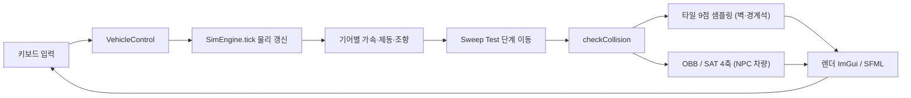

# C++ 운전면허 시뮬레이션 — 베스트 드라이버 (Best Driver - C++ Driving Simulation)
> C++로 차량 물리 엔진과 충돌 판정을 직접 구현하고 6인 팀의 코드 병합·메인 루프·공용 타입 설계를 총괄한 운전면허 도로주행 시뮬레이션 프로젝트입니다.


## 📌 프로젝트 정보
| 항목 | 내용 |
|------|------|
| 프로젝트명 | bestdriver_GENISIS — 운전면허 도로주행 시뮬레이터 |
| 개발 기간 | 2026.03.30 ~ 2026.04.10 |
| 팀 구성 | 6인 팀 프로젝트 (2팀) |
| 담당 역할 | 팀장 · 코드 병합, 메인 루프 제작, 차량 물리 엔진 설계, 프로젝트 공용 타입 설계 |
| 시연 영상 | 준비 중 |

## 🎯 프로젝트 개요
국가 면허 2종 보통 시험의 A·B 코스와 T자·평행 주차장을 2D로 정밀하게 재현한 C++ 기반 도로주행 시뮬레이션입니다. 차량의 위치와 조향각을 실시간으로 계산하고, 벽·경계석·NPC 차량과의 충돌을 판정하기 위해 자체 시뮬레이션 엔진(`SimEngine`)을 설계했습니다.

저는 팀장으로서 차량 물리 엔진을 직접 구현하고, 프로젝트 공용 타입을 설계했으며, 메인 루프를 제작해 6인 팀원이 각각 구현한 맵·렌더·신호·채점·입력 모듈을 하나의 실행 가능한 시뮬레이션으로 병합했습니다.

## ✨ 주요 기능 / 담당 업무
- **SimEngine 물리 엔진 설계**: 매 프레임 호출되는 `tick(dt, ctrl)`에서 기어(P·R·N·D) 상태에 따라 가속 방향을 결정하고, 가속·제동·조향·관성 감속을 물리 상수 기반으로 갱신해 부드럽고 사실적인 차량 움직임을 구현했습니다.
- **Sweep Test 이동 처리**: 한 프레임의 이동량을 0.015 단위로 세분화해 단계별로 전진하며, 빠른 속도에서도 벽을 관통하지 않도록 마지막 안전 지점까지만 이동하고 충돌 시 밀어내기(back-off)·속도 반전을 적용했습니다.
- **OBB + SAT 충돌 판정**: NPC 차량과의 충돌을 OBB(Oriented Bounding Box)에 SAT(분리축 정리) 4축 판정으로 검출하고, 차량 모서리·변 8점 샘플링을 보조 판정으로 결합했습니다.
- **타일 맵 9점 샘플링**: 벽·경계석 충돌은 차량 전후·좌우·중심 9개 지점을 맵 타일의 `isPassable`로 샘플링해, NPC OBB 판정과 하나의 `checkCollision()` 파이프라인으로 통합했습니다.
- **메인 루프 및 코드 병합**: 입력→물리→충돌→렌더 모듈 간 인터페이스(`VehicleControl`, `VehicleState` 등 공용 타입)를 정의하고, 6인 팀원의 작업을 단일 실행 파일로 통합했습니다.

## 🛠 기술 스택
### 개발 환경
- **C++** — 시뮬레이션 엔진 및 전체 로직 구현
- **Visual Studio** — 개발 IDE

### 라이브러리
- **SFML** — 2D 렌더링, 윈도우·입력 처리
- **Dear ImGui + ImGui-SFML** — 조작 패널·상태 표시 UI

## 🔀 시스템 아키텍처

키보드 입력을 `VehicleControl` 구조체로 받아 `SimEngine.tick()`에서 물리를 갱신하고, Sweep Test로 단계별 이동하며 매 단계마다 `checkCollision()`(타일 9점 샘플링 + NPC OBB/SAT 판정)을 거쳐 ImGui/SFML로 매 프레임 렌더링하는 흐름입니다.

## 💻 핵심 코드 (담당 역할)

### 1. `SimEngine::tick()` — 기어별 물리 갱신
기어 상태에 따라 가속 방향을 결정하고, 가속·제동·관성 감속을 물리 상수 기반으로 적용해 매 프레임 차량 속도를 갱신합니다.
```cpp
void SimEngine::tick(float dt, const VehicleControl& ctrl) {
    if (collisionCooldown_ > 0.0f) collisionCooldown_ -= dt;
    if (finished_) return;
    vehicle_.gear = ctrl.gear; vehicle_.engineOn = ctrl.engineOn;

    float aDir = 0;
    if (vehicle_.gear == Gear::D) aDir = 1;
    else if (vehicle_.gear == Gear::R) aDir = -1;

    if (vehicle_.gear == Gear::P || vehicle_.gear == Gear::N) {
        vehicle_.speed *= 0.85f;                       // P/N: 가속 무시, 관성 감속
        if (std::abs(vehicle_.speed) < 0.1f) vehicle_.speed = 0;
    } else {
        vehicle_.speed += ctrl.accel * PHY_ACCEL * aDir * dt;
        if (ctrl.brake > 0) {                          // 브레이크: 0 아래로 내려가지 않게
            if (vehicle_.speed > 0) { vehicle_.speed -= PHY_BRAKE * ctrl.brake * dt;
                if (vehicle_.speed < 0) vehicle_.speed = 0; }
        }
        if (ctrl.accel < 0.01f && ctrl.brake < 0.01f) vehicle_.speed *= 0.92f;
    }
    vehicle_.speed = clampFloat(vehicle_.speed, -PHY_MAX_REV, PHY_MAX_FWD);
    // ... 조향 갱신 및 Sweep Test 이동 (아래)
}
```

### 2. Sweep Test — 단계별 이동으로 벽 관통 방지
한 프레임의 이동 거리를 0.015 단위로 세분화해 단계별로 충돌을 검사하고, 마지막 안전 지점까지만 이동합니다. 충돌 시 밀어내기와 속도 반전을 적용합니다.
```cpp
int steps = (int)std::ceil(dist / 0.015f);
if (steps < 1) steps = 1;

float lastSafeX = vehicle_.position.x, lastSafeY = vehicle_.position.y;
bool hit = false;
for (int i = 1; i <= steps; ++i) {
    float t  = (float)i / (float)steps;
    float nx = vehicle_.position.x + dx * t;
    float ny = vehicle_.position.y + dy * t;
    if (checkCollision(nx, ny)) { hit = true; break; }   // 충돌 직전 지점에서 멈춤
    lastSafeX = nx; lastSafeY = ny;
}
if (!hit) { vehicle_.position.x = tx; vehicle_.position.y = ty; }
else {
    vehicle_.position.x = lastSafeX; vehicle_.position.y = lastSafeY;
    float backoff = 0.05f;                               // 벽에서 살짝 밀어냄
    vehicle_.position.x -= (dx / mvLen) * backoff;
    vehicle_.position.y -= (dy / mvLen) * backoff;
    vehicle_.speed *= -0.1f;                             // 속도 반전(반발)
    if (collisionCooldown_ <= 0.0f) { collisions_++; collisionCooldown_ = 2.0f; }
}
```

### 3. OBB + SAT 4축 충돌 판정
플레이어 차량과 NPC 차량의 회전된 사각형(OBB)을 네 개의 분리축에 투영해, 어느 한 축에서라도 겹치지 않으면 충돌이 아니라고 판정합니다.
```cpp
static bool obbIntersects(const RectOBB& a, const RectOBB& b) {
    if (!overlapOnAxis(a, b, a.axisX)) return false;   // 4개 분리축 중
    if (!overlapOnAxis(a, b, a.axisY)) return false;   // 하나라도 분리되면
    if (!overlapOnAxis(a, b, b.axisX)) return false;   // 충돌 아님
    if (!overlapOnAxis(a, b, b.axisY)) return false;
    return true;                                        // 모든 축에서 겹침 → 충돌
}

static bool overlapOnAxis(const RectOBB& a, const RectOBB& b, const Vec2& axis) {
    Vec2 n = normalize2(axis);
    float aMin, aMax, bMin, bMax;
    projectOBB(a, n, aMin, aMax);                       // 각 OBB의 4꼭짓점을 축에 투영
    projectOBB(b, n, bMin, bMax);
    return !(aMax < bMin || bMax < aMin);               // 투영 구간이 겹치는지
}
```

## 🔧 기술적 도전과 해결 (Technical Challenges)

### Q1. 빠른 속도에서 차량이 벽을 통과하는 문제를 어떻게 막았나요?
> **Challenge:** 매 프레임 목표 위치(`tx, ty`)로 단번에 이동시키면, 속도가 빠를 때 한 프레임 이동 거리가 벽 두께보다 커져 벽을 그대로 관통(터널링)하는 현상이 발생했습니다.
> **Solution:** 한 프레임 이동량을 `dist / 0.015f` 만큼의 단계로 세분화하는 **Sweep Test**를 도입했습니다. 단계마다 `checkCollision()`으로 충돌을 검사하며 전진하다가, 충돌이 감지되면 직전 안전 지점(`lastSafeX/Y`)에서 멈추고 살짝 밀어내기(back-off) 후 속도를 반전시켜 벽에 박혀버리거나 관통하지 않도록 했습니다.

### Q2. 회전한 차량들 사이의 충돌은 어떻게 정확히 판정했나요?
> **Challenge:** 차량은 임의 각도로 회전하므로 축에 정렬된 단순 사각형(AABB) 판정으로는 비스듬히 마주 선 차량을 정확히 검출할 수 없었습니다.
> **Solution:** 차량을 회전 사각형(OBB)으로 모델링하고 **SAT(분리축 정리)** 4축 판정을 적용했습니다. 두 OBB의 X·Y축을 분리축 후보로 삼아 각 축에 꼭짓점을 투영하고, 한 축에서라도 투영 구간이 분리되면 충돌이 아니라고 즉시 판정합니다. OBB 판정에 더해 차량 모서리·변 8점이 NPC 내부에 들어왔는지도 보조로 검사해 경계 케이스를 보강했습니다.

### Q3. 벽 충돌이 보도 경계나 주차된 NPC 근처에서 오탐(false positive)을 내는 문제는?
> **Challenge:** 차량 중심 한 점만으로 타일 통과 가능 여부를 검사하면, 차체 모서리가 벽에 닿았는데도 통과되거나 반대로 보도 경계·정차한 NPC 옆에서 멀쩡한데도 충돌로 잘못 잡히는 경우가 있었습니다.
> **Solution:** 차량 진행 방향(`fwdOff`)과 좌우(`latOff`) 오프셋을 보수적으로 잡아 전·후·좌·우와 중심까지 **9개 지점을 타일 샘플링**하고, 각 지점을 `isPassable`로 검사했습니다. 오프셋 값을 보도 끝선·주차 차량과의 오탐을 피하도록 조정해, 한 점 검사보다 정밀하면서도 과민하지 않은 벽 판정을 구현했습니다.

## 📸 스크린샷
> `images/` 폴더에 아래 화면 캡처를 추가해 주세요.

| 화면 | 설명 |
|------|------|
|  | 시작 메뉴 화면 (주/야간 환경 변화·패럴랙스 배경 애니메이션) |
|  | A코스 시내 도로 주행 (신호등·횡단보도·NPC 차량) |
|  | B코스 회전교차로 복합 도로 주행 |
|  | T자·평행 주차 모드 (목표 슬롯 가이드·주차 성공 그린 글로우) |
|  | 시험 결과 점수판 및 감점 상세 화면 |

## 🎬 시연 영상
> 준비 중입니다.
