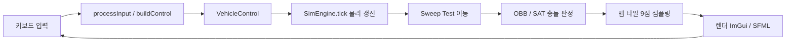
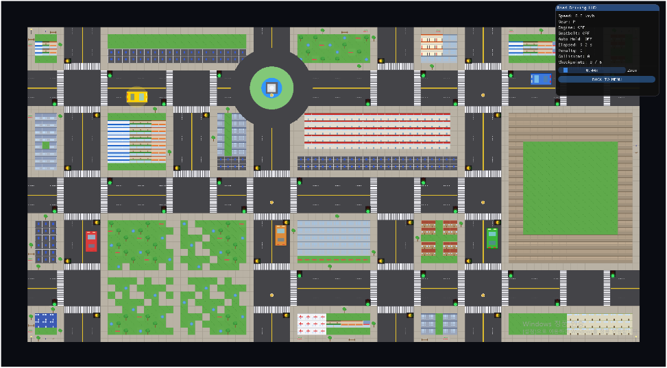
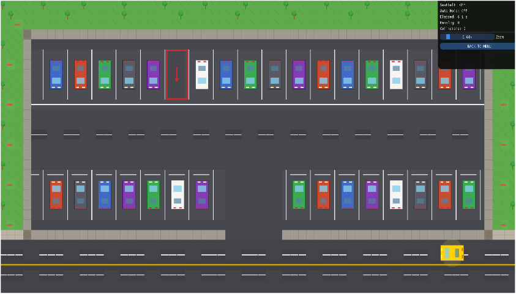

# C++ 운전면허 시뮬레이션 — 베스트 드라이버 (Best Driver - C++ Driving Simulation)
> C++로 차량 물리·충돌 판정·입력 처리를 직접 구현하고 6인 팀의 전체 통합을 총괄한 운전면허 주행 시뮬레이션 프로젝트입니다.

## 📌 프로젝트 정보
| 항목 | 내용 |
|------|------|
| 개발 기간 | 2026.03.30 ~ 2026.04.10 |
| 팀 구성 | 6인 팀 프로젝트 |
| 담당 역할 | 팀장 · 전체 설계 및 통합, SimEngine 모듈 구현 |
| 시연 영상 | 준비 중 |

## 🎯 프로젝트 개요
운전면허 주행 시험 상황을 재현한 C++ 기반 2D 주행 시뮬레이션입니다. 차량의 가속·제동·조향을 물리 법칙에 따라 갱신하고, 벽과 NPC 차량과의 충돌을 정밀하게 판정하기 위해 자체 시뮬레이션 엔진(SimEngine)을 설계했습니다. 저는 팀장으로서 SimEngine 모듈을 직접 구현하고, 입력·물리·충돌·렌더 모듈 간의 인터페이스를 정의하여 팀 전체의 코드 통합을 총괄했습니다.

## ✨ 주요 기능 / 담당 업무
- **SimEngine 클래스 설계**: 매 프레임 호출되는 `tick()` 함수에서 차량 물리(가속·제동·조향)를 갱신하고, Sweep Test 기반 이동 처리로 빠른 속도에서도 충돌을 놓치지 않도록 구현했습니다.
- **OBB 충돌 판정**: OBB(Oriented Bounding Box)에 SAT(분리축 정리) 4축 판정을 적용하고, 맵 타일 9점 샘플링을 결합하여 벽과 NPC 차량 충돌을 하나의 파이프라인으로 통합 검출했습니다.
- **입력 처리 시스템**: `processInput()` / `buildControl()`로 키보드 입력을 `VehicleControl` 구조체로 변환하고, 에지 감지 기반 토글로 시동·기어·방향지시등 상태를 안정적으로 전환하도록 설계했습니다.
- **팀 전체 모듈 통합 및 설계 총괄**: 입력·물리·충돌·렌더 모듈의 인터페이스를 정의하고, 6인 팀원의 작업을 하나의 실행 가능한 시뮬레이션으로 통합했습니다.

## 🛠 기술 스택
### Software
- **C++** — 시뮬레이션 엔진 및 전체 로직 구현
- **Dear ImGui** — 상태 표시 및 디버그 UI
- **SFML** — 윈도우·렌더링·입력 처리

## 🔀 시스템 아키텍처

키보드 입력을 `VehicleControl`로 변환한 뒤 `SimEngine.tick()`에서 물리를 갱신하고, Sweep Test 이동과 OBB/SAT·타일 샘플링 충돌 판정을 거쳐 ImGui/SFML로 매 프레임 렌더링하는 흐름입니다.

## 📸 스크린샷
> `images/` 폴더에 이미지를 추가한 뒤 아래 경로를 맞춰주세요.

| 화면 | 설명 |
|------|------|
|  | 주행 시뮬레이션 메인 화면 |
|  | 충돌 판정 및 차량 상태 디버그 UI |

## 🎬 시연 영상

